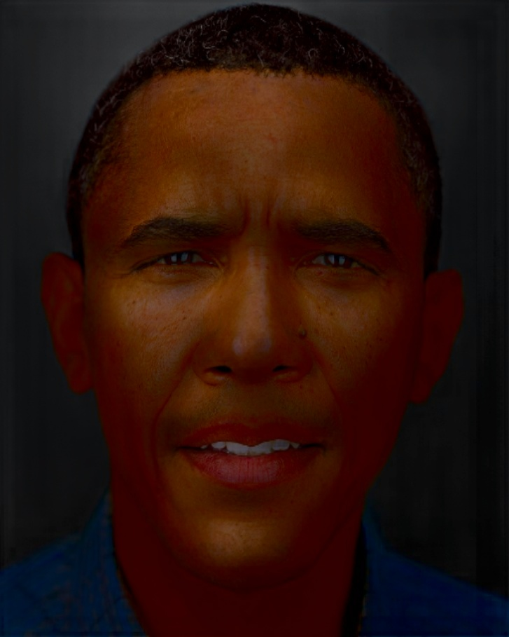
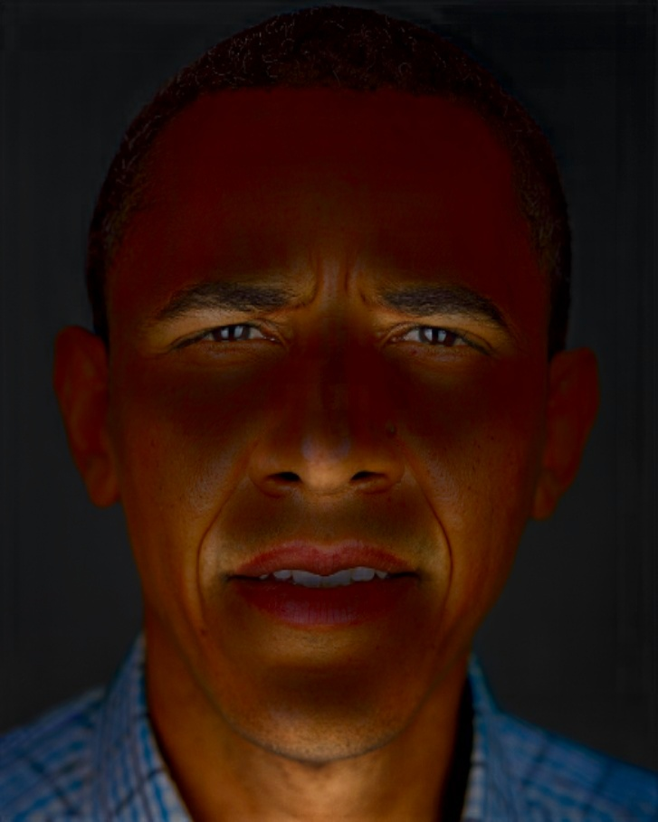
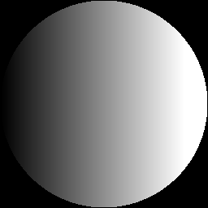
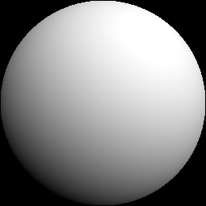
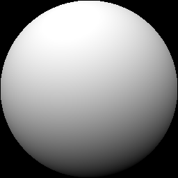
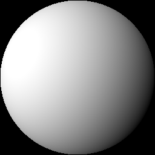
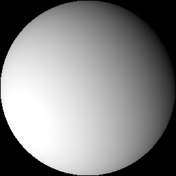
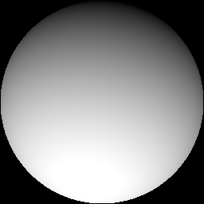
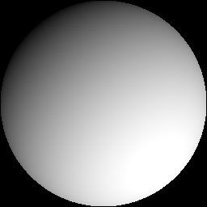

<!--<h3><b>DPR</b></h3>-->
## <b>Deep Single-Image Portrait Relighting</b> [[Project Page]](http://zhhoper.github.io/dpr.html) <br>
Hao Zhou, Sunil Hadap, Kalyan Sunkavalli, David W. Jacobs. In ICCV, 2019

<p>






</p>
<p>






</p>

### Overview
 - Test script for 512x512 images: `testNetwork_demo_512.py`
 - Test script for 1024x1024 images: `testNetwork_demo_1024.py`

### Dependencies ###
<p> pytorch >= 1.0.0 </p>
<p> opencv >= 4.0.0 </p>
<P> shtools: https://shtools.oca.eu/shtools/ (optional)</p>

# Notes
We include an example image and seven example lightings in data. Note that different methods may have different coordinate system for Spherical Harmonics (SH), you may need to change the coordiante system if you use SH lighting from other sources. The coordinate system of our method is in accordance with shtools, we provide a function utils_normal.py in utils to help you tansfer the coordinate system from [bip2017](https://gravis.dmi.unibas.ch/PMM/data/bip/) and [sfsNet](https://senguptaumd.github.io/SfSNet/) to our coordinate system. To use utils_normal.py you need to install shtools. The code is for research purpose only.
--- 

# Brightness Configuration File

This configuration file contains settings that include 9 coefficients related to lighting.

```text
1.084125496282453138e+00
-4.642676300617166185e-01
2.837846795150648915e-02
6.765292733937575687e-01
-3.594067725393816914e-01
4.790996460111427574e-02
-2.280054643781863066e-01
-8.125983081159608712e-02
2.881082012687687932e-01
```
- The **first coefficient** represents the ambient light. This value determines the overall base brightness of the image regardless of direction.
- The **next 3 coefficients** represent directional linear lighting along the x, y, and z axes respectively. These values specify the main light direction (left/right, up/down, front/back) shining onto the face.
  - **Light along X axis**: Controls the directional    light intensity along the X axis (left ↔ right).
  - **Light along Y axis**: Controls the directional light intensity along the Y axis (up ↔ down).
  - **Light along Z axis**: Controls the directional light intensity along the Z axis (front ↔ back).

- The **last 5 coefficients** represent complex lighting details used for more accurate simulation of light diffusion and softer shadows on curved surfaces (such as a human face).
  - **Coefficient dependent on x·y**: Represents lighting variations influenced by the interaction between the X and Y axes.
  - **Coefficient dependent on y·z**: Represents lighting variations influenced by the interaction between the Y and Z axes.
  - **Coefficient dependent on 3z² − 1**: Controls spherical lighting deformation related to the Z‑axis curvature component.
  - **Coefficient dependent on x·z**: Represents lighting variations influenced by the interaction between the X and Z axes.
  - **Coefficient dependent on x² − y²**: Describes lighting differences caused by the relative contribution of the X and Y axes.

These coefficients work together to create a realistic lighting effect in the rendered image.

---

### Data Preparation
We publish the code for data preparation, please find it in (https://github.com/zhhoper/RI_render_DPR).

### Citation
If you use this code for your research, please consider citing:
```
@InProceedings{DPR,
  title={Deep Single Portrait Image Relighting},
  author = {Hao Zhou and Sunil Hadap and Kalyan Sunkavalli and David W. Jacobs},
  booktitle={International Conference on Computer Vision (ICCV)},
  year={2019}
}
```
